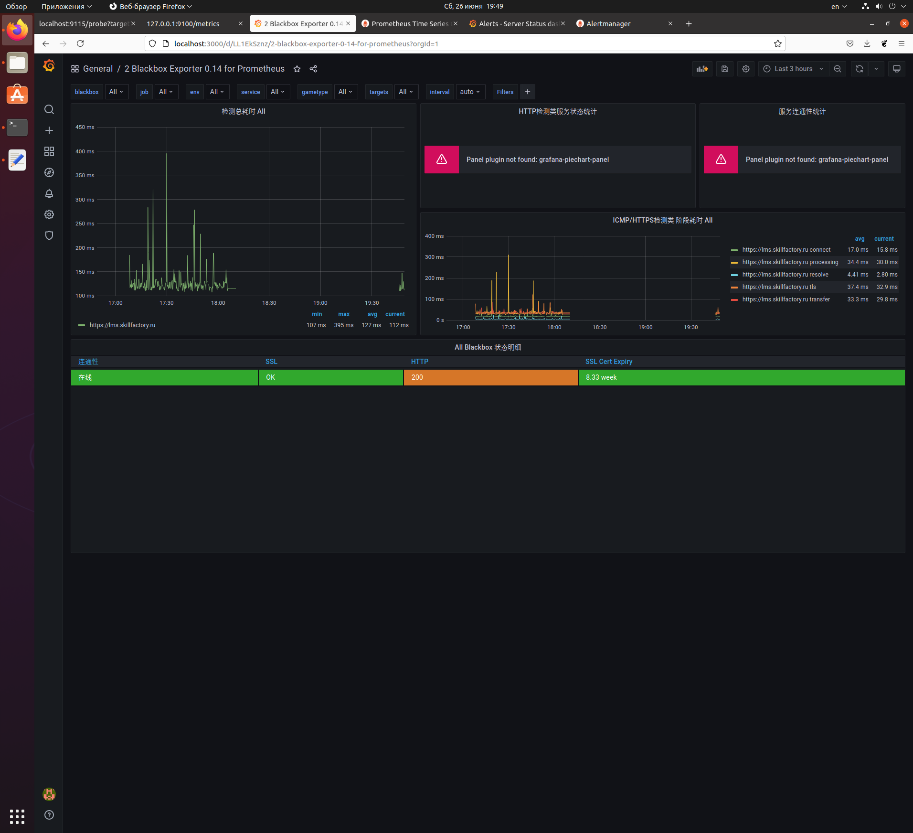
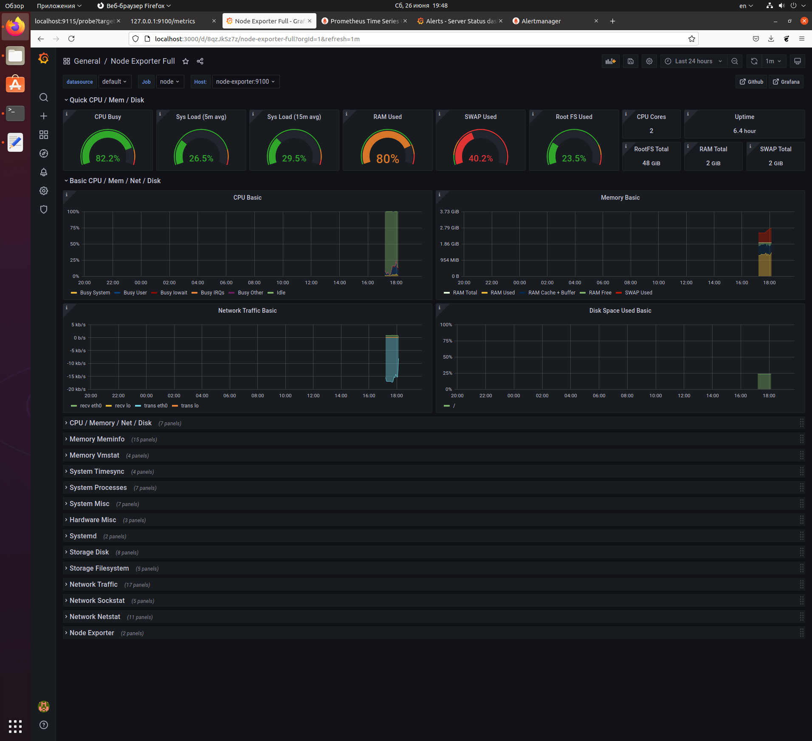
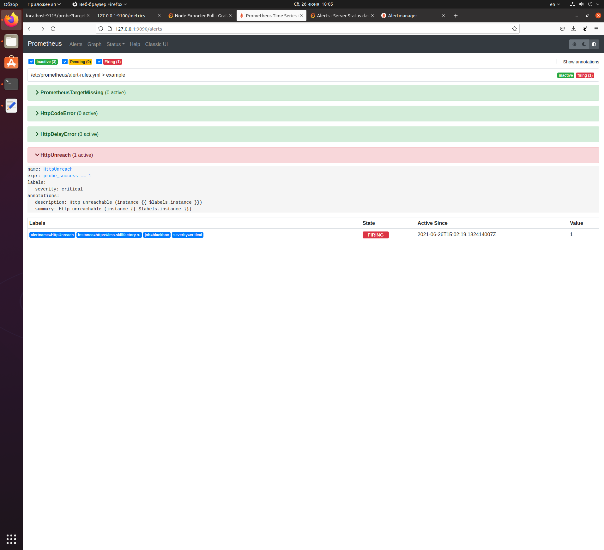
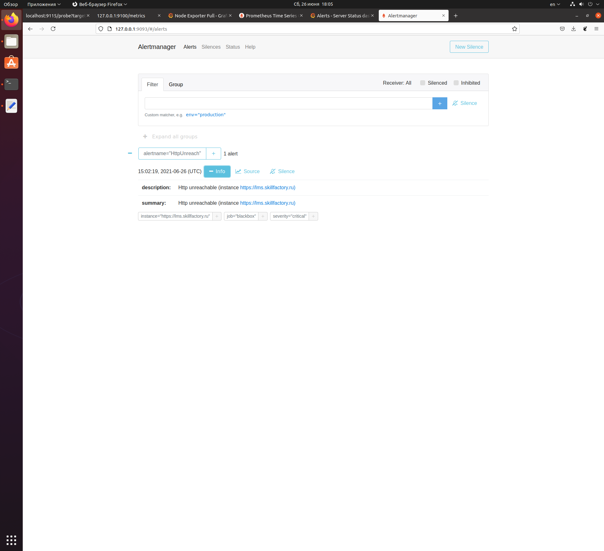

# SkillFactory: DEVOPS. Практикум. Модуль 25. Мониторинг

## Задание 

Разверните Prometheus Stack через docker-compose, в котором будет:

- Prometheus,
- Grafana,
- Node Exporter,
- Blackbox Exporter,
- AlertManager.

Соберите метрики с https://lms.skillfactory.ru через Blackbox, соберите метрики с вашего сервера через Node Exporter.

Создайте dashboard в Grafana, в котором будут отображены следующие метрики:

На вашем сервере (или локальной машине):

- время работы (Uptime);
- нагрузка на процессор (CPU) в %;
- использование памяти (RAM) в %;
- использование диска в %.

На lms.skillfactory.ru:

- возвращаемый статус-код;
- задержка ответа сайта;
- срок действия сертификата.

Добавьте алерты в AlertManager на следующие события:

- изменился статус-код сайта lms.skillfactory.ru,
- задержка превышает 5 секунд lms.skillfactory.ru,
- сервер перезагрузился (через метрику Uptime).

## Решение

Для решения задачи создан docker-compose файл

Графики настраиваются вручную

Алерты проверял на измененном правиле, см ниже

